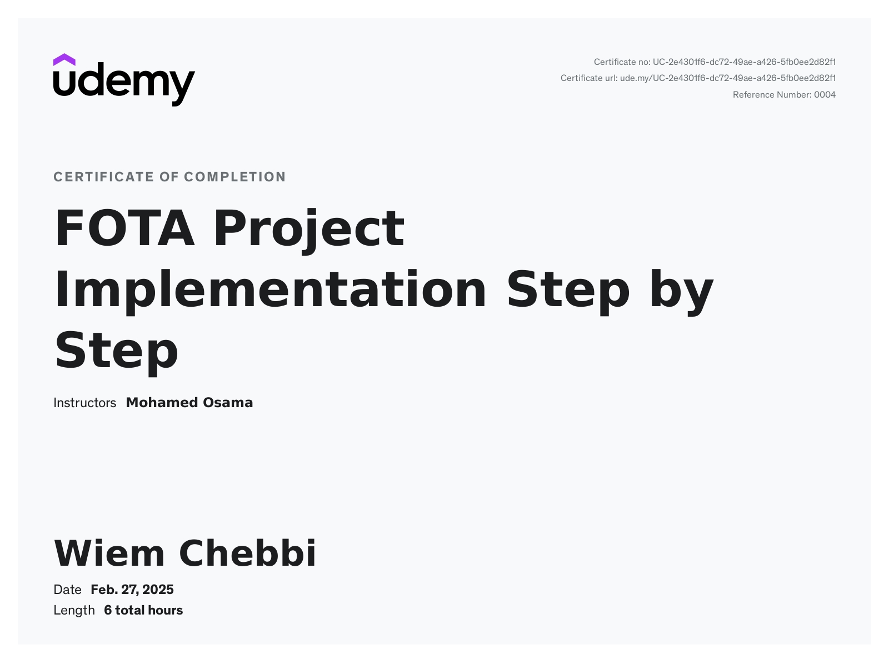

## 🎓 Related Certification

This project was part of my learning journey in **Firmware Over-The-Air (FOTA)** and **STM32 bootloader development**.

### 🧠 Skills & Technologies Learned

| Area                      | Skills / Technologies                                           |
| ------------------------- | --------------------------------------------------------------- |
| **Programming**           | Embedded C                                                      |
| **Microcontroller**       | STM32                                                           |
| **Bootloader**            | Custom STM32 Bootloader                                         |
| **Firmware Update**       | FOTA / Remote Firmware Update                                   |
| **Cloud**                 | Firebase Storage                                                |
| **Messaging Protocol**    | MQTT                                                            |
| **MCU Communication**     | UART                                                            |
| **Memory Management**     | Flash Erase, Flash Write, Application Memory Mapping            |
| **Firmware Integrity**    | CRC Verification                                                |
| **Boot Process**          | Vector Table, Stack Pointer, Reset Handler, Jump to Application |
| **Firmware Transfer**     | Binary firmware download, packet transfer and programming       |
| **Embedded Architecture** | Bootloader + Application separation                             |

### 🔄 What the Project Helped Me Understand

```text
Firebase / Cloud
       ↓
Firmware Binary
       ↓
MQTT / Update Trigger
       ↓
Gateway
       ↓
UART Communication
       ↓
STM32 Bootloader
       ↓
Flash Programming
       ↓
Application
```

This project helped me understand the full firmware update flow, from receiving a new firmware image remotely to validating, transferring and programming it into the STM32 microcontroller.



